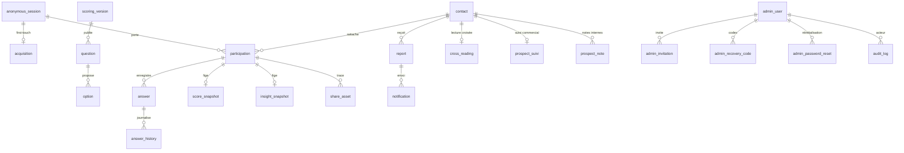

# Documentation d'architecture — Radar by FeexPay

Livrable H.2 n°2, exigé par le CDC F.1 (« choix consignés dans la documentation
d'architecture »). Ce document décrit ce qui est réellement déployé, pas ce qui avait été
envisagé : les écarts par rapport au plan initial sont signalés et motivés.

Version du 10 septembre 2026. À mettre à jour à chaque changement de choix technique.

---

## 1. Vue d'ensemble

Radar by FeexPay est une application web mobile-first qui produit deux diagnostics — profil
du dirigeant (14 questions, 8 archétypes) et rayonnement de l'entreprise (7 questions, score
0–100) — et remet un rapport par email. Le résultat est affiché **avant** tout formulaire.

L'application est un monolithe : un seul projet Nuxt sert les pages publiques, l'espace
d'administration et l'API. Il n'y a ni second serveur, ni navigateur sans interface, ni file
d'attente. Ce choix est la conséquence directe de trois substitutions décrites au §3, et il
rend le déploiement possible sur des fonctions éphémères.

```
Navigateur ──── HTTPS ────▶ Nuxt 4 / Nitro (Vercel, région cdg1)
                            │  pages publiques P01→P14
                            │  espace admin A01→A10
                            │  API /api/public, /api/admin, /api/cron
                            │
                            ├── pg (TCP 5432, TLS) ──▶ Supabase Postgres 17 (Frankfurt)
                            ├── HTTPS ───────────────▶ Supabase Auth (mot de passe, TOTP, sessions)
                            ├── HTTPS ───────────────▶ Resend (email + PDF joint, webhook entrant)
                            ├── HTTPS ───────────────▶ Meta Conversions API
                            └── HTTPS ───────────────▶ GA4 Measurement Protocol

Vercel Cron ─── GET /api/cron/abandon (Authorization: Bearer) ──▶ clôture des parcours expirés
```

Un seul environnement existe aujourd'hui : le projet Supabase de développement, qui sert
aussi de pré-production. **La séparation staging / production reste à créer** avant la mise
en ligne — voir §8.

---

## 2. Choix techniques et exigence satisfaite

| Choix | Exigence CDC | Motif |
|---|---|---|
| Nuxt 4 monolithe (pages + API Nitro) | F.1 | Un seul déploiement, un seul jeu de secrets, pas de CORS ni de second cycle de vie à exploiter. |
| Postgres via `pg` en accès direct serveur | F.1, G.1 | Requêtes explicites, transactions maîtrisées, aucune surcouche à auditer. |
| RLS activée et forcée sans aucune policy | G.1, G.3 | Refus par défaut : aucune table métier n'est joignable depuis un client. Tout accès passe par Nitro. |
| Jetons publics opaques, condensat seul en base | G.3 | Une fuite de la base ne rend aucun lien de résultat ni de rapport utilisable. |
| Supabase Auth pour l'administration | E.1 | Mot de passe, TOTP et sessions gérés par une brique éprouvée plutôt que réécrits. |
| Politique de mot de passe : 12 caractères + contrôle HIBP | E.1 | Longueur imposée et rejet des mots de passe figurant dans les fuites connues, par k-anonymat (aucun mot de passe ne quitte le serveur). |
| Second facteur TOTP obligatoire Analyste et Administrateur | E.1 | `aal2` exigé par le middleware, jamais seulement masqué dans l'interface. |
| RBAC vérifié dans chaque handler | E.3 | Les menus masqués ne sont pas une protection : le rôle est contrôlé côté serveur, à chaque appel. |
| `audit_log` append-only (trigger d'immutabilité) | E.3, G.5 | Un journal qu'un administrateur compromis ne peut ni corriger ni effacer. |
| Snapshots de scores et d'insights immuables | F.2 | Un rapport relu six mois plus tard donne le même résultat, avec la version du moteur qui l'a produit. |
| Moteur de scoring pur, sans dépendance, versionné | F.2 | Testable hors base, rejouable, et deux versions coexistent (2.1 archivée, 2.2 publiée). |
| Consentement préalable, tracking coupé par défaut | RGPD | Aucun traceur non nécessaire avant choix explicite ; `tracking_enabled` coupe tout, quel que soit le consentement. |
| En-têtes HSTS, CSP, X-Frame-Options, Referrer-Policy | G.5 | Voir §6. |

### Écarts assumés par rapport au plan initial

| Prévu | Réalisé | Motif |
|---|---|---|
| Drizzle ORM, `packages/db` | SQL brut dans `supabase/migrations/`, `pg` côté serveur | Le SQL est la source de vérité ; un miroir TypeScript aurait été une seconde vérité à maintenir. |
| Module `@nuxtjs/supabase` | Client Supabase serveur maison (`server/utils/supabase.ts`) | Le module expose un client au navigateur ; ici aucun accès client à la base n'est voulu. |
| pg-boss + Playwright pour le PDF | jsPDF, génération synchrone à la demande | Supprime le worker, la file et le navigateur sans interface. C'est ce qui rend le déploiement sur fonctions éphémères possible. |
| `nuxt-og-image` + dépôt sur Storage | Carte dessinée sur canvas côté navigateur | L'image ne transite pas par le serveur ; seule la trace est conservée dans `share_asset`. |
| `packages/email`, 6 gabarits vue-email | HTML en ligne, 4 envois (rapport, invitation, réinitialisation, alerte sécurité) | Volume insuffisant pour justifier un paquet dédié. |
| Exports asynchrones journalisés | Exports synchrones, journalisés dans `export_job` | Conséquence de l'abandon de pg-boss ; les volumes actuels tiennent dans une requête. |
| Intégration continue GitHub Actions | Contrôles lancés en local avant livraison | Décision du 9 septembre 2026 : le déploiement passe par Vercel. **C'est une faiblesse assumée** — rien n'empêche mécaniquement une livraison sans tests. |

---

## 3. Modèle de données

28 tables dans le schéma `public`, toutes en RLS activée et forcée, sans aucune policy.



**Groupes de tables.**

- *Référentiel du moteur* : `scoring_version`, `question`, `option`. Une seule version
  `published` à la fois (index unique partiel), et une version publiée est gelée par trigger.
- *Parcours* : `anonymous_session`, `acquisition`, `participation`, `answer`,
  `answer_history`. L'acquisition est first-touch, unique par session et immuable.
- *Résultats* : `score_snapshot`, `insight_snapshot`, `cross_reading`. Un snapshot par
  participation, immuable, relu avec la version qui l'a produit.
- *Conversion* : `contact`, `report`, `share_asset`, `notification`.
- *Administration* : `admin_user`, `admin_invitation`, `admin_recovery_code`,
  `admin_password_reset`, `audit_log`, `app_setting`, `export_job`.
- *Commercial* : `prospect_suivi`, `prospect_note`, `levier_feexpay`, `levier_constat`.
- *Conformité et mesure* : `consent_record`, `tracking_event_outbox`.

**Triggers structurants.** Immutabilité (`answer_history`, `score_snapshot`,
`insight_snapshot`, `acquisition`, `audit_log`), gel d'une version publiée, protection du
dernier administrateur actif, cohérence option/question sur `answer`.

La source de vérité est `supabase/migrations/`, appliquée dans l'ordre des noms de fichiers.
Le schéma est rejoué à chaque test sur une base Postgres en mémoire (PGlite), ce qui vaut
contrôle de reproductibilité des migrations.

---

## 4. Flux sensibles

**Jetons publics.** Session (`radar_sid`), participation, rapport et réinitialisation sont
des jetons opaques de 32 octets. Seul leur condensat SHA-256 est stocké. Un jeton de rapport
n'est pas lié à la session : il arrive par email et doit rester consultable plus tard. Un
renvoi de rapport émet un nouveau jeton et invalide l'ancien.

**Secrets.** `SUPABASE_SERVICE_KEY`, `DATABASE_URL`, `RESEND_API_KEY`,
`RESEND_WEBHOOK_SECRET` et `CRON_SECRET` sont lus par `runtimeConfig` hors du bloc `public`
et ne franchissent jamais la frontière du serveur. Le contrôle est fait après build par
`grep` sur `.output/public` (voir `docs/RECETTE.md`).

Les identifiants de tracking modifiables en exploitation vivent dans `app_setting`, avec un
indicateur `secret` : une valeur secrète est masquée à l'affichage et n'est jamais renvoyée
au navigateur — `reglagesPublics()` n'expose que `tracking_enabled`, `ga4_measurement_id` et
`meta_pixel_id`.

**Point ouvert, décision du 10 septembre 2026 :** le jeton d'accès Meta CAPI figure en clair
dans `supabase/migrations/20260908000000_admin_v2.sql`, donc dans l'historique git. Il a été
décidé de ne pas le retirer. Quiconque obtient une copie du dépôt peut envoyer des
événements au compte publicitaire concerné. La régénération du jeton côté Meta reste
possible à tout moment et lèverait cette exposition.

**Données personnelles.** Prénom, nom, entreprise, email et téléphone ne sont demandés
qu'après affichage du résultat. Le téléphone est facultatif. Vers Meta CAPI, email et
téléphone partent condensés en SHA-256, jamais en clair. Vers GA4 ne partent que des
événements sans donnée nominative. Les réponses au questionnaire ne sortent jamais du
serveur autrement que sous forme de résultat.

**Ce qui ne sort jamais du serveur.** Le barème (`mapping` des options), les poids, les
hypothèses commerciales, la priorité produit FeexPay et le détail du départage d'archétypes.
La projection publique (`packages/scoring/src/public.ts`) est la seule surface exposée, et un
test de recette vérifie l'absence de fuite dans les réponses d'API.

**Administration.** Cookie httpOnly `radar_admin` portant les jetons Supabase, `secure` hors
développement, `sameSite=lax`. Toute réduction de privilèges (rôle abaissé, suspension,
révocation, réinitialisation de mot de passe) coupe les sessions ouvertes. Le second facteur
est exigé par le middleware, jamais seulement masqué dans l'interface.

---

## 5. Tracking

Deux chemins, l'un dans le navigateur, l'autre côté serveur.

Le navigateur charge GA4 (`gtag`, `send_page_view` désactivé) après acceptation de la
catégorie statistique, et Meta Pixel après acceptation de la catégorie publicitaire. Les
identifiants viennent des réglages serveur.

Le serveur envoie ce que le navigateur ne peut pas envoyer : `Lead` et `quiz_completed` vers
Meta CAPI, avec l'`event_id` que le Pixel a utilisé — c'est ce qui permet à Meta de
dédupliquer ; `report_generated` et `report_sent` vers GA4 Measurement Protocol, parce que
ces deux événements surviennent après que le navigateur a quitté la page.

Tout envoi serveur passe par `tracking_event_outbox`. L'unicité de `event_id` porte
l'idempotence : un rejeu, une double soumission ou une relance ne produisent qu'un seul
envoi. Les échecs restent visibles dans la table, avec leur cause et le compteur de
tentatives. Aucun envoi n'est bloquant : une panne du fournisseur de mesure n'interrompt ni
un parcours, ni l'envoi d'un rapport.

---

## 6. Durcissement HTTP

Posés par `routeRules` dans `nuxt.config.ts` :
`Strict-Transport-Security` (2 ans, sous-domaines, preload), `X-Content-Type-Options`,
`X-Frame-Options: DENY`, `Referrer-Policy: strict-origin-when-cross-origin`,
`Permissions-Policy` (caméra, micro, géolocalisation, paiement, USB refusés) et une
`Content-Security-Policy` qui n'autorise que les origines du plan de tracking, avec
`frame-ancestors 'none'`, `object-src 'none'`, `base-uri 'self'` et `form-action 'self'`.

HSTS et CSP ne sont posées qu'en production : le rechargement à chaud de Vite exige `eval` et
une connexion WebSocket.

**Compromis à connaître.** La CSP porte `script-src 'unsafe-inline'`. Nuxt écrit le payload
d'hydratation dans un script en ligne, sans nonce ; l'interdire casserait l'application. La
CSP protège donc contre le chargement de scripts tiers non prévus, pas contre une injection
en ligne. Poser un nonce demanderait un middleware de rendu — à faire si le besoin se
confirme.

Toutes les routes portent `X-Robots-Tag: noindex, nofollow`, sauf `/`.

---

## 7. Déploiement

Vercel, région `cdg1` (Paris), depuis la branche `main`. La base est le projet Supabase de
Francfort.

`DATABASE_URL` doit pointer le **pooler Supavisor en mode session** : la connexion directe de
Supabase est joignable en IPv6 seulement et les fonctions Vercel n'ont pas d'egress IPv6. Ne
jamais utiliser le port 6543 (mode transaction) : il ne prend pas en charge les requêtes
préparées, dont `pg` se sert.

Une tâche planifiée quotidienne (`vercel.json`) appelle `/api/cron/abandon` à 3 h UTC.

Variables d'environnement attendues : voir `.env.example`. `CRON_SECRET` doit être défini
côté Vercel, sans quoi la route de clôture refuse tout appel.

Un passage à Docker (application et base réunies dans une pile auto-contenue) est à l'étude
et fera l'objet d'une révision de ce document.

---

## 8. Sauvegardes et restauration

**État actuel, à corriger avant la mise en ligne.** Les sauvegardes reposent sur le plan
Supabase du projet. Aucune restauration n'a été testée et aucun RPO/RTO n'est contractualisé.
Trois actions restent dues :

1. Confirmer le plan de sauvegarde du projet Supabase après son transfert à FeexPay :
   sauvegarde quotidienne au minimum, PITR si le plan le permet.
2. Créer un projet de production distinct du projet de développement actuel, qui sert
   aujourd'hui aux deux usages et contient des données de test.
3. Exécuter une restauration complète sur un projet neuf et consigner ici sa durée réelle.

**Objectifs proposés, à valider :** RPO 24 h (sauvegarde quotidienne), RTO 4 h (restauration
Supabase, puis redéploiement Vercel).

**Procédure de restauration.** Restaurer la sauvegarde Supabase sur un projet neuf ; rejouer
`supabase/migrations/` si la sauvegarde est antérieure à une migration ; publier la version
du moteur (`pnpm seed:scoring`) ; mettre à jour `DATABASE_URL`, `SUPABASE_URL` et
`SUPABASE_SERVICE_KEY` côté Vercel ; redéployer ; vérifier `/api/public/health`, qui compare
le condensat de la version publiée en base à celui du moteur embarqué.

Ce que la restauration ne rétablit pas : les jetons de rapport déjà distribués restent
valables puisque leur condensat est en base, mais les sessions administrateur ouvertes chez
Supabase Auth sont perdues — reconnexion et second facteur exigés.

---

## 9. Risques et mesures

| Risque | Effet | Mesure |
|---|---|---|
| Latence Abidjan → Francfort | Parcours ralenti pour l'utilisateur cible | Aucune région Afrique chez Supabase. Pages servies depuis `cdg1`, requêtes groupées, PDF généré à la demande sans aller-retour supplémentaire. À mesurer en conditions réelles avant la mise en ligne. |
| Base injoignable | Parcours interrompu | Les réponses sont mises en file locale dans le navigateur et rejouées au retour du réseau ; l'écriture serveur est idempotente. |
| Fournisseur de mesure en panne | Aucun | Envois non bloquants, échecs journalisés dans `tracking_event_outbox`. |
| Email refusé ou non délivré | Rapport non reçu | Le rapport reste consultable en ligne par son lien ; le statut d'envoi est suivi par le webhook Resend et le renvoi est possible depuis A07. |
| Absence d'intégration continue | Livraison sans contrôle | Les huit suites sont à lancer en local avant chaque livraison ; la liste est dans `docs/RECETTE.md`. À corriger par un workflow. |
| Un seul projet Supabase | Une erreur de développement touche les données réelles | Créer un projet de production distinct (voir §8). |
| Jeton Meta CAPI dans l'historique git | Envoi d'événements par un tiers | Décision de ne pas le retirer ; régénération possible côté Meta. |
| Compte de test administrateur actif | Accès non prévu | `test-admin-mtt3ombj@feexpay.me` à révoquer une fois le premier administrateur réel actif. |
| CSP avec `unsafe-inline` | Injection en ligne non bloquée | Voir §6 ; nonce à envisager. |

---

## 10. Références

- `PLAN.md` — plan de développement, modèle de données détaillé, spécification du moteur.
- `docs/RECETTE.md` — recette technique, suites de tests, restes avant mise en ligne.
- `docs/RUNBOOK.md` — exploitation courante et incidents.
- `docs/MANUEL_ADMIN.md` — manuel de l'espace interne.
- `docs/DNS_radar.feexpay.me.md` — dossier DNS et délivrabilité des emails.
- `openapi.json` — contrat des 55 routes de l'API.
